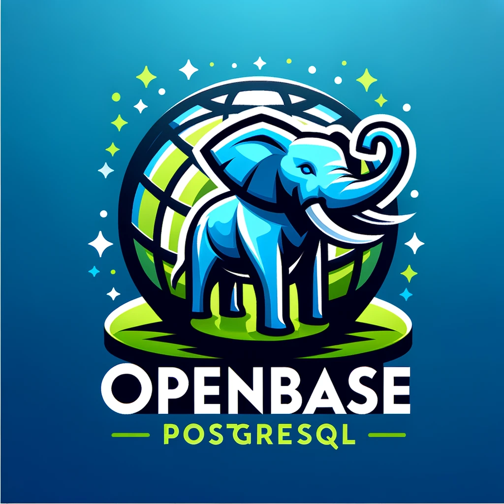

# OpenBaseNET para Postgresql




> OpenBaseNET para Postgresql é um template para projetos .net 9 usando base de dados Postgresql.
O template foi construído devido a necessidade de criar projetos  forma rápida e prática.

## Para criar um projeto, basta seguir os passos abaixo:

#### Crie seu projeto usando o template OpenBaseNET <br/>


#### Baixe seu projeto para sua máquina <br/>
```bash
git clone <projeto>
```
#### Dentro da Pasta _01-Presentation_, acesse o arquivo appsettings.json e altere a string de conexão para a sua base de dados <br/>
```json
{
  "ConnectionStrings": {
    "OpenBasePostgresql": "Server=127.0.0.1;Port=5432;Database=openbase;User Id=openbase;Password=openbase;"
  },
  "Logging": {
    "LogLevel": {
      "Default": "Information",
      "Microsoft.AspNetCore": "Warning"
    }
  },
  "AllowedHosts": "*"
}
```
#### No projeto OpenBaseNET.Application acesse a pasta Entities e crie suas classes para representar as suas entidades (existe um modelo chamado Customer, use como exemplo) <br/>
   É extemamente importante que a classe implemente a interface _IEntityOrQueryResult_ <br/>
```csharp
namespace OpenBaseNET.Domain.Entities;

public sealed class Customer : IEntityOrQueryResult
{
    public int Id { get; set; }
    public Name Name { set; get; } = null!;
 
}
```
#### No Projeto OpenBaseNET.Infra.Data.Context acesse a pasta Configurations e crie a classe de mapeamento da sua entidade (existe um modelo chamado CustomerMapping, use como exemplo) <br/>
```csharp
namespace OpenBaseNET.Infra.Data.Context.Configurations;

internal sealed class CustomerConfiguration : IEntityTypeConfiguration<Customer>
{
    public void Configure(EntityTypeBuilder<Customer> builder)
    {
        builder.ToTable("CLITAB");

        builder.HasKey(c => c.Id)
            .HasName("PK_CLITAB");

        builder
            .Property(c => c.Id)
            .HasColumnName("CLIID");
        
        builder
            .OwnsOne(
                c => c.Name, 
                name =>
            {
                    name.Property(n => n.Value)
                    .HasColumnName("CLINM")
                    .HasMaxLength(255)
                    .IsRequired();
            });
    }
}
```

# Pronto!
>A partir de agora você pode criar suas classes de serviço, repositório e controlador para sua entidade <br/>
Caso você siga o padrão de nomenclatura do template não precisará fazer nenhuma configuração adicional <br/>
